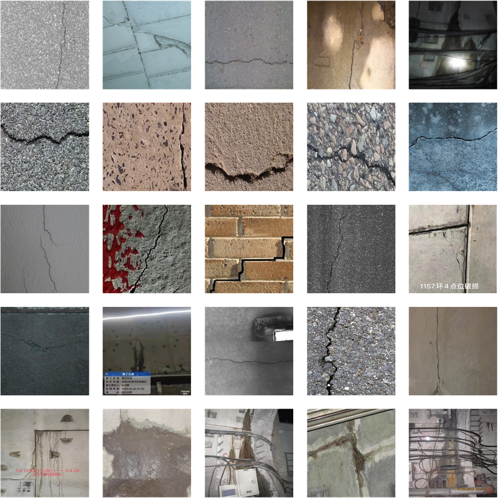
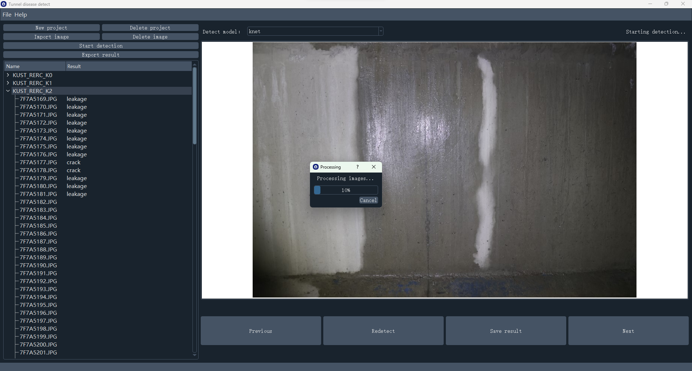
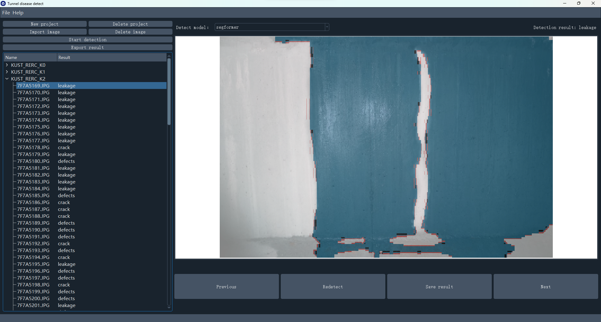

# 2024.

# Tunnel_lining_multi-category_defect_segmentation_detection


  <h3 align="center">Introduce</h3>
  <p text-indent:14px>
      &nbsp;&nbsp;&nbsp;&nbsp;&nbsp;&nbsp;The project is " Tunnel lining multi-category defect segmentation detection based on deep learning " this research paper open dataset, algorithm model, Tunnel defects detect application.
      <br />
      &nbsp;&nbsp;&nbsp;&nbsp;&nbsp;&nbsp;The datasets folder contains large-scale image data used to train deep learning models for tunnel cracks and leaks.
      <br />
      &nbsp;&nbsp;&nbsp;&nbsp;&nbsp;&nbsp;The Algorithm models folder contains the tunnel lining defect detection model trained on this dataset based on the pre-trained model.
      <br />
    <br />
  </p>
<p align="center">
    
    
    
    
</p>


## Directory

- [File Directory Description](#FileDirectoryDescription)
- [Author](#Author)

<br/>

### File Directory Description
eg:

```
filetree 
├── algorithm mode
│  ├── deeplabv3
│  ├── deeplabv3plus
│  ├── fastsc
│  ├── knet
│  ├── pspnet
│  ├── segformer
│  ├── unet
├── dataset
│  ├── crack
│  ├── leakage
│  ├── defects
│  ├── no defects
├── Tunnel disease detect
├── README.md

```


### Author

Jingqi Cui
